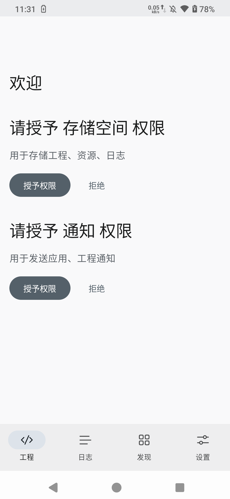
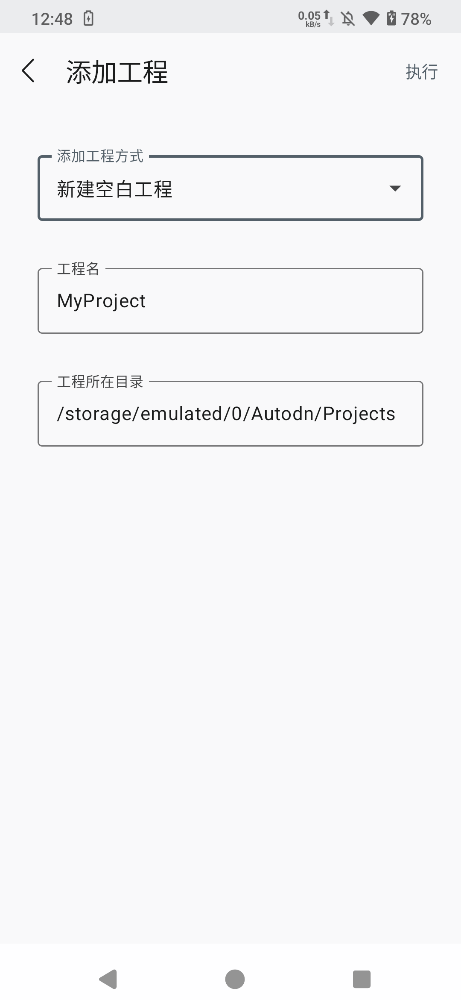
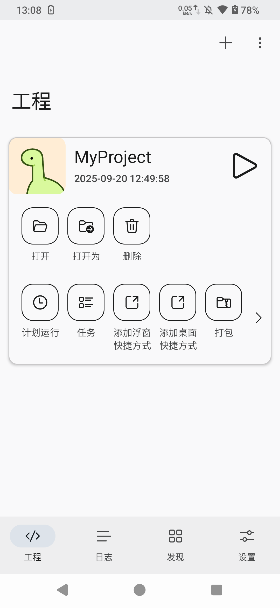

# 快速开始

## 安装应用

请查看 [安装应用](/guide/install-app) 页面获取应用。

## 权限授予

欢迎页面会提示索要 `存储空间`，`通知` 权限，你可以选择授予，或者拒绝，并稍后在设置中授予。

授予 `存储空间` 权限后，Auto.dn 会在外部存储空间中创建文件夹 `/storage/emulated/0/Autodn`，该文件夹用于存放工程、资源、日志等相关文件。

授予 `通知` 权限后，Auto.dn 可以显示应用、工程、服务等相关内容的通知。

## 添加工程

点击右上方 `+` 添加按钮。

添加工程方式选择 `新建空白工程`，点击右上角 `执行`，随即会在 `/storage/emulated/0/Autodn/Projects` 目录下新建工程。

## 运行工程

在工程页面，点击右侧运行按钮即可运行工程。

