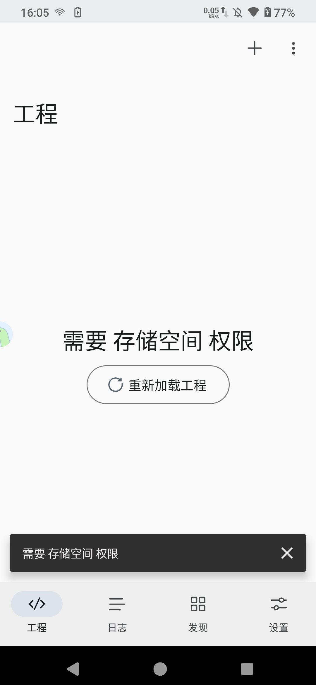
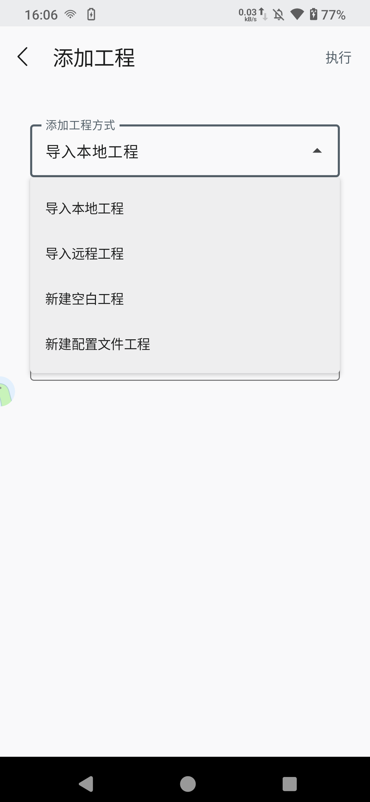
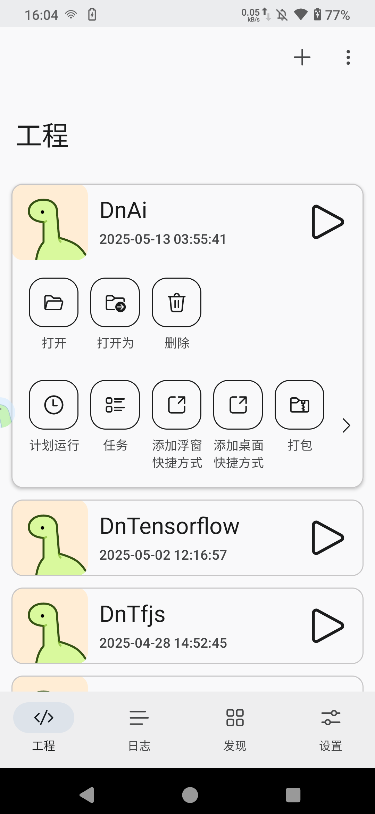

# 快速开始

## 安装应用

-   [Github Releases](https://github.com/AuTsing/denofa_release/releases)
-   [百度网盘]
-   [夸克网盘]

## 创建工程

### 权限授予

开启应用后会提示索要文件管理权限，请允许，Auto.dn 会在外部储存空间中创建文件夹 `/storage/emulated/0/Denofa`，该文件夹用于存放工程、日志、资源、配置等文件。

### 添加工程

点击右上方添加按钮可以通过多种方式添加工程。

### 通过 PC 添加工程

在 PC 新建任意一个工程文件夹，然后然后通过 VSCode 打开。

通过 VSCode 扩展市场安装[扩展](https://marketplace.visualstudio.com/items?itemName=autsing.denofa-vscode-ext)。

使用 `Ctrl` + `Shift` + `P` 调出命令面板。

输入 `Denofa: 初始化工作区` 初始化工作区。

## 运行工程

### 直接运行工程

在工程页面，点击右侧运行按钮即可运行工程。

### 通过 PC 运行工程

在 APP 设置页面，点击 WS 服务器按钮启用 WS 服务。

在 VSCode 使用 `Ctrl` + `Shift` + `P` 调出命令面板。

输入 `Denofa: 连接设备` ，然后输入显示在 APP 中的 `ws://` 开头的地址连接设备。

在 VSCode 使用 `Ctrl` + `Shift` + `P` 调出命令面板。

输入 `Denofa: 运行工程` 传输并运行工程。
